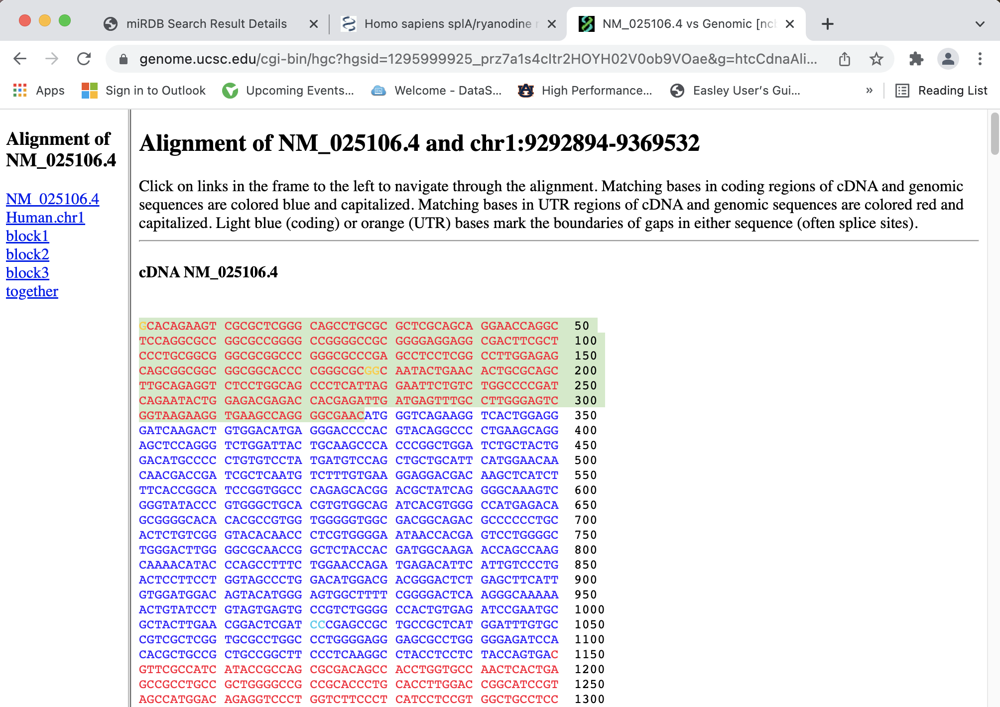

```{r setup, include=FALSE}
knitr::opts_chunk$set(echo = TRUE)
```

miRDB: miRNA binding site prediction software

http://mirdb.org/

##miRDB is a great tool for predicting the binding sites of miRNAs in a transcript, and especially in the 3' UTR.
### All that is needed for using this tool is a computer with WiFi.

### 1. Go to http://mirdb.org/
### Select the desired function. On the home page, one can search for a specific miRNA or Gene Target
### For this tutorial we will focus on "Custom Prediction".


### Select Custom Prediction from the list of functions on the left.

### 2. For this tutorial, we will select 'Human'for Species and the 'Sample target mRNA sequence' as an example, which will auto-populate when selected. 
### Importantly, if you input your own sequence from UCSC or anywhere else, use FASTA format. 
### This software is forgiving of spaces and numbers input with the FASTA sequence, however,t his program does not allow you to utilise the carat '> NM_0000 Sample' format at the beginning, so leave this out.
### Select 'Go' to initiate the prediction.


### 3. When it is finished running, select 'Retrieve Prediction Results'


### 4. The output file will describe how many predicted miRNAs target the input region.
### THe predicted miRNAs will be ranked in order of Target Score.
### It is important to note that sometimes the outputs of similar sequences will vary a bit in the exact order of miRNAs listed for this reason--verify that the miRNA you compare is in both by examining the entire list--it may be in a different order and still be predicted to be present in the sequence.


### 5. One can click on a desired miRNA for information regarding the specific site locations by clicking the red hyperlink hsa-miR-5011-5p, for example.
### The higher the target score, the more one can trust the prediction. Prediction scores over 80 are thought to be valid.
### This also gives the exact miRNA Sequence, the Seed Location(s) and the input Target Length.
### When analyzing two separate inputs, such as a Wild-type sequence vs. a Mutant sequence with an introduced variation, one can easily compare the number of seed locations found in one vs. the other by comparing these side-by-side.


### 6. Going back to the original Prediction output table, one can instead select the 'Details' button to the left of the miRNA of interest.
### This will display useful information regarding both the mature and precursor miRNAs, their sequences, genomic location, and validated and predicted targets.
### It is also helpful to read the References on literature in which the miRNA of interest has been investigated.


### 7. From the 'Details' page above, one can click on 'Predicted Targets' to see the full list that the miRNA of interest may target.
### Again, these are ranked and given a Target Score to help select those that are most likely to be valid targets. 

### 8. For this example, we will select the first Predicted Target by selecting 'Target Gene'.
### This details all of the Seed Locations within its 3' UTR, length of the 3' UTR, the exact miRNA sequence and Target Score.
### It also includes a Gene Description and a helpful 'NCBI Gene ID' hyperlink to further investigate the targeted gene.


### 9. Clicking on the 'NCBI Gene ID' hyperlink will open a new window with the gene page in the NCBI database. 
### From here, one can select 'FASTA' directly under the bold heading in order to view the nucleotide sequence.


### 10. After selecting the FASTA sequence, the accession number for the target gene can be copied. 


### 11. In a new browser window, search for 'UCSC Genome Browser' and select 'UCSC Genome Browser Home'


### 12. Then, select 'Genome Browser' option (highlighted in green).

### 13. From here, select 'Human' and select 'Dec. 2013 GrCh38(hg38)'
### Past the accession number obtained from the NCBI FASTA page, and select 'Go'.

### 14. Select the Dark blue 'NCBI RefSeq genes' track (highlighted in green).


### 15. This will display the RefSeq gene information for the target gene.
### Select the 'mRNA/Genomic Alignment' (highlighted in green).


### 16. This displays both the cDNA and genomic DNA sequences. This is where one can obtain the exact sequence regions of interest for the target gene.


### 17. We originally saw that the miRNA had binding sites in the 3' UTR of the target gene, but using this cDNA sequence, we can also determine if it binds in the 3' UTR (or the entire transcript-- we will focus on the 5' UTR for now in this tutorial).
### Copy the entire 5' UTR (highlighted in green).
### Red letters at the beginning of the sequence denote non-coding regions; blue denote coding regions.


### 18. Open a new browser window with http://mirdb.org/ 
### Paste the entire copied sequence into the text box. Select 'Human' for Species. This time, do NOT select Sample target mRNA input. Select 'Go'. 

### 19. Again, select the Predicted Sequences output link.
### Now, one can see that there are two predicted miRNAs binding to the 5' UTR of the target gene, and its nucleotide length.


### 20. From here, one can further investigate the miRNAs by both clicking on the red hyperlink with its name and/or selecting 'Details' to view the References and locations as we did before at the beginning of this tutorial. 


## This tutorial is meant to guide one through the steps of obtaining miRNA binding site predictions for a sequence of interest--this could be an entire cDNA (mRNA) sequence, or even simply a gene's 3' UTR (a common binding site for miRNAs). It is important to investigate the potential interaction of various miRNAs with target genes. For example, some miRNAs can have oncogenic properties when they bind and disrupt the localization of a DNA repair gene and cause aberrant protein expression to occur, promoting oncogenesis. (Si et al. citation below) miRDB is an excellent tool for guiding this investigation as it has an extensive databse of miRNAs and target genes. It also has a good amount of references populated for each miRNA, which is very useful when amassing literature for a review or academic research.

## Although not covered in this tutorial, miRDB has other functions (as seen in Step 1 on the left side of the webpage) such as:
### Target Search http://mirdb.org/index.html (Search by miRNA name or by gene target)
### Target Expression http://mirdb.org/expression.html (Identify a miRNA of interest and select a cell line of interest for target prediction.)
### Target Ontology http://mirdb.org/ontology.html (Identify a miRNA of interest and select a Gene Ontology category for target functional analysis in PANTHER.)
### Target Mining http://mirdb.org/mining.html (When searching for miRNA gene targets, full mature miRNA names are required. When searching for miRNAs, you may provide either NCBI gene IDs or official gene symbols.)
### FuncMir Collection http://mirdb.org/FuncMir.html (FuncMir is a collection of functional miRNAs in humans and mice. Currently, FuncMir includes 568 human precursor miRNAs, 654 human mature miRNAs, 452 mouse precursor miRNAs and 442 mouse mature miRNAs.)
### Data Download (miRDB Data Download set of Target Prediction Files)
### Statistics pages (miRDB statistics on predicted miRNA gene targets in human, mouse, rat, dog and chicken.)
## for extra resources when investigating both genes and miRNAs of interest. It also has a very useful 'Help | FAQ' page for further information on how the software functions and how they evaluated that a target score of >80 was predicted to be valid, for example. http://mirdb.org/faq.html

## Next steps for the savvy researcher include using the information in this tutorial to obtain FASTA sequences for their own gene or miRNA of interest and utilizing not only the 'Custom Prediction' feature, but the others listed above to help understand the relationships between miRNAs and their targets and how they translate into disease or prevention of disease, etc.

## Overall, miRDB is an essential tool for predicting miRNA binding and gene targets. It is a great resource for not only making predictions, but also learning more about the literature behind each component. 

### References:
#### Si W, Shen J, Zheng H, Fan W. The role and mechanisms of action of microRNAs in cancer drug resistance. Clin Epigenetics. 2019;11(1):25. Published 2019 Feb 11. doi:10.1186/s13148-018-0587-8 https://pubmed.ncbi.nlm.nih.gov/30744689/

#### Chen Y, Wang X. miRDB: an online database for prediction of functional microRNA targets. Nucleic Acids Res. 2020;48(D1):D127-D131. doi:10.1093/nar/gkz757 https://pubmed.ncbi.nlm.nih.gov/31504780/

#### Liu W, Wang X. Prediction of functional microRNA targets by integrative modeling of microRNA binding and target expression data. Genome Biol. 2019;20(1):18. Published 2019 Jan 22. doi:10.1186/s13059-019-1629-z https://pubmed.ncbi.nlm.nih.gov/30670076/
